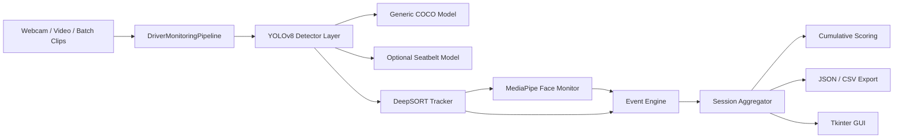
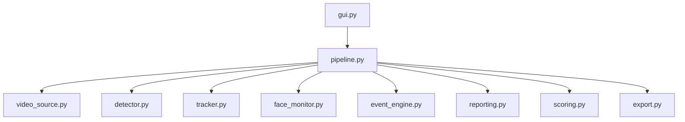
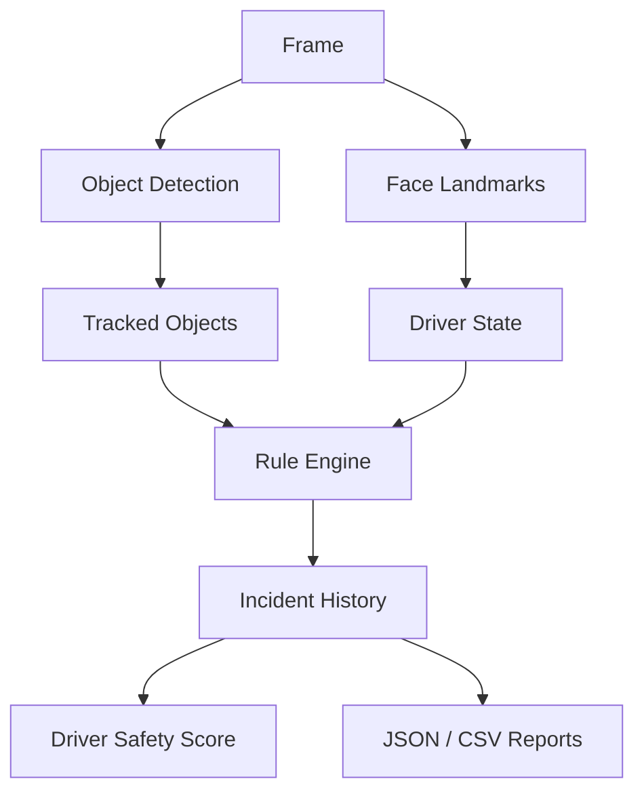

# DriveGuard AI

DriveGuard AI is a modular Python prototype for **driver monitoring** and **video telematics**. It analyzes a webcam stream or offline cabin videos to detect risky behaviors such as phone use, distraction, drowsiness, yawning, and missing seatbelt usage, then aggregates incidents into session-level reports with a cumulative safety score.

The repository is designed as a **portfolio and prototyping environment** rather than a production-ready fleet platform. It demonstrates how real-time computer vision, temporal tracking, rule-based behavior analysis, and report generation can be combined into one coherent driver-risk pipeline.

## Vision

The long-term goal is to move from a simple vision demo to a more complete driver-risk analysis system where:

- a cabin video is processed locally or offline
- risky driver behaviors are detected over time, not only frame by frame
- incidents are aggregated into a session history
- a cumulative driver safety score is produced
- structured JSON/CSV reports can be exported for later review or integration

Today, the repository already contains the foundation for that workflow.

## What The Project Contains

The current solution includes:

- a **desktop GUI** built with Tkinter
- a **generic object detection layer** based on Ultralytics YOLOv8
- a **specialized seatbelt detector** loaded as an optional second YOLO model
- a **tracking layer** based on DeepSORT
- a **driver face analysis layer** based on MediaPipe Face Landmarker
- a **rule-based event engine**
- a **session reporting layer** with cumulative scoring and JSON/CSV export

At a high level, the system supports this flow:

1. capture frames from a webcam, one video file, or a batch of clips
2. detect objects such as person, phone, and other cabin-relevant objects
3. detect seatbelt-specific states through a dedicated model when available
4. track objects over time with persistent IDs
5. estimate head orientation, off-road gaze proxy, eyes closed, and yawning
6. convert temporal signals into incidents such as `PHONE_USE`, `DISTRACTION`, `DROWSINESS`, and `NO_SEATBELT`
7. aggregate incidents into a source-level session report
8. export reports to JSON and CSV

## Main Features

### Desktop Application

- three source modes:
  - webcam
  - single video
  - batch clips
- live annotated preview in the GUI
- live score and event summary
- final source and batch summary messages

### Headless Execution

- reusable headless runner for non-GUI execution
- explicit core inference facade for video, batch, and webcam analysis
- local CLI for webcam, single-video, and batch analysis
- local FastAPI API for service-style local execution
- lightweight Tkinter API client for quickly testing local endpoints

### Vision Pipeline

- YOLOv8 generic object detection
- optional dedicated seatbelt YOLO model
- DeepSORT temporal tracking
- MediaPipe-based facial landmark analysis
- session-safe source transitions

### Driver Behavior Logic

- phone-near-face tracking and `PHONE_USE`
- off-road head/gaze proxy and `DISTRACTION`
- eyes-closed duration and `DROWSINESS`
- yawning detection
- seatbelt-present / seatbelt-missing integration

### Reporting

- incident history per source
- cumulative driver score per clip
- batch roll-up summary
- JSON export per source
- CSV incident export per source
- batch JSON summary export

## Repository Structure

```text
DriveGuardAI/
├─ README.md
├─ yolo.py
├─ yolo.ipynb
├─ yolov8n.pt
├─ yolo-Weights/
│  └─ yolov8n.pt
├─ driver_monitoring/
│  ├─ gui.py
│  ├─ pipeline.py
│  ├─ video_source.py
│  ├─ detector.py
│  ├─ tracker.py
│  ├─ face_monitor.py
│  ├─ event_engine.py
│  ├─ scoring.py
│  ├─ reporting.py
│  ├─ export.py
│  └─ assets/
│     ├─ face_landmarker.task
│     └─ seatbelt_best.pt
└─ outputs/
   └─ run_*/
```

## Architecture Overview

The codebase is intentionally modular. Each layer has a focused responsibility.

- `video_source.py`
  - webcam, video file, and batch clip ingestion
- `detector.py`
  - generic YOLO detector
  - optional seatbelt YOLO detector
  - merged normalized detections
- `tracker.py`
  - DeepSORT-based temporal object tracking
- `face_monitor.py`
  - MediaPipe-based head, eye, mouth, and off-road state estimation
- `event_engine.py`
  - rule-based behavior events
- `reporting.py`
  - incident aggregation and session reports
- `scoring.py`
  - cumulative session scoring
- `export.py`
  - overlays and JSON/CSV output
- `gui.py`
  - desktop orchestration and presentation layer
- `core.py`
  - stable inference facade reused by CLI and API
- `contracts.py`
  - backend-grade request/response models
- `pipeline.py`
  - end-to-end runtime coordination

## Full Pipeline



## Modular Runtime View



## Behavior Analysis Flow



## Current Implementation Status

### Implemented

- Tkinter GUI with webcam, single-video, and batch modes
- YOLOv8 generic object detection
- optional dedicated seatbelt model integration
- DeepSORT tracking
- MediaPipe face landmark analysis
- phone, distraction, drowsiness, yawning, and seatbelt event logic
- source-level incident aggregation
- cumulative session scoring
- JSON/CSV report generation
- batch summary export

### In Progress

- calibration of thresholds for real cabin footage
- better driver/seatbelt spatial association logic
- more robust interpretation of `incorrect_seatbelt`
- improvement of incident quality on difficult lighting and camera angles

### Planned

- backend/API integration
- persistent storage beyond local export files
- richer scoring policies
- stronger event traceability
- dedicated fleet / insurer dashboard
- deployment hardening and edge-device support

## Current Limits

The system is functional as a prototype, but it still has important limitations.

### Product limits

- no backend service or database exists yet
- no user authentication, fleet management, or remote API exists
- no multi-camera orchestration exists
- no real insurer workflow is implemented

### Vision limits

- driver attention is approximated from head orientation, not true gaze tracking
- detection quality depends heavily on cabin camera position, lighting, occlusion, and video quality
- seatbelt logic depends on the quality and label semantics of the external seatbelt model
- some behaviors are still inferred by heuristics rather than learned sequence models

### Modeling limits

- the score is rule-based, not statistically calibrated
- no domain-specific training has been done on a proprietary trucking dataset
- `incorrect_seatbelt` is currently treated conservatively as a missing-seatbelt condition
- the system does not yet distinguish driver seat from passengers with strong identity guarantees

### Runtime limits

- inference runs locally on CPU by default and may be slow on weak hardware
- the GUI is designed for prototyping, not industrial deployment
- outputs are local files, not synchronized records

## Running Locally

### Requirements

- Python 3.x
- `ultralytics`
- `opencv-python`
- `pillow`
- `deep-sort-realtime`
- `mediapipe`

Install dependencies:

```bash
python -m pip install ultralytics opencv-python pillow deep-sort-realtime mediapipe
```

### Configuration

Runtime behavior is externally configurable through `config.toml`.

This includes:

- model paths
- detector confidence threshold
- face-analysis thresholds
- event thresholds
- output directory
- capture dimensions

This phase makes the engine calibration-ready, but true threshold calibration still requires real cabin footage that is not included in the repository.

### Start the application

```bash
python yolo.py
```

### Run without Tkinter

Single video:

```bash
python -m driver_monitoring.cli video --source path/to/video.mp4
```

Batch:

```bash
python -m driver_monitoring.cli batch --sources clip1.mp4 clip2.mp4
```

Webcam:

```bash
python -m driver_monitoring.cli webcam --device 0
```

### Local API

Start the API locally with:

```bash
python -m uvicorn driver_monitoring.api:app --host 127.0.0.1 --port 8000
```

Then use:

- `GET /health`
- `POST /analyze/video`
- `POST /analyze/batch`

### Lightweight API Test GUI

To validate local API calls quickly through a small Tkinter client:

```bash
python -m driver_monitoring.api_gui
```

This helper GUI lets you:

- set the local API base URL
- choose a single video or a batch of clips
- call `GET /health`
- call the local analysis endpoints
- inspect the JSON response directly

### Optional seatbelt model

If `driver_monitoring/assets/seatbelt_best.pt` is present, DriveGuard AI automatically enables the dedicated seatbelt detector alongside the main COCO model.

### Tests

Run the local test suite with:

```bash
python -m unittest discover -s tests -v
```

## Output Artifacts

Each run generates a directory under `outputs/run_*` containing:

- one JSON summary per processed source
- one CSV incident table per processed source
- one batch summary JSON file

## Tech Stack

- Python
- Ultralytics YOLOv8
- OpenCV
- DeepSORT
- MediaPipe Tasks
- Tkinter
- JSON / CSV export

## Development Notes

- the repository started from a simple YOLO webcam detector and has been progressively refactored into a modular driver-monitoring prototype
- the current architecture already supports iterative extension without rewriting the full pipeline
- the project is intentionally explicit and educational: each layer remains understandable and separable

## Roadmap

- improve event calibration with real cabin footage
- refine seatbelt and phone-driver association logic
- add richer temporal driver behavior reasoning
- introduce backend services and persistent storage
- build a dedicated fleet / insurer review interface
